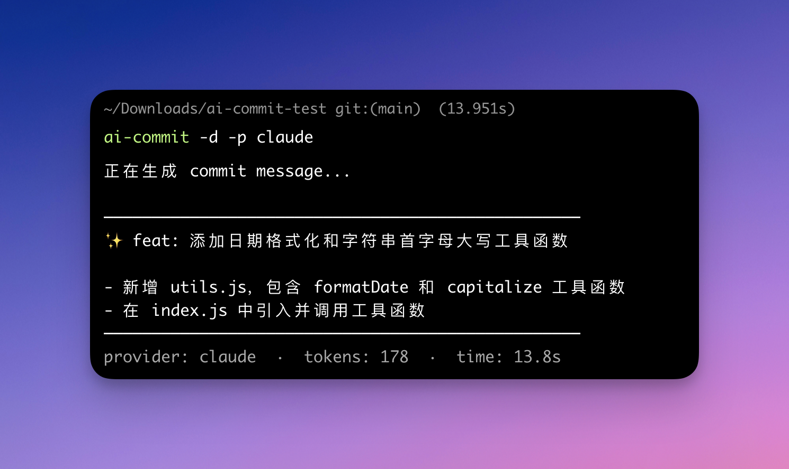

# AI Commit

[中文文档](./README_zh.md)

AI-powered Git commit message generator. Analyzes your staged changes and generates [Conventional Commits](https://www.conventionalcommits.org/) formatted messages using any OpenAI-compatible LLM or [Claude Code](https://docs.anthropic.com/en/docs/claude-code).



## Install

One-line install (macOS / Linux):

```bash
curl -fsSL https://raw.githubusercontent.com/lifedever/ai-commit/main/install.sh | bash
```

> Requires: Git, Node.js >= 18, npm

## Configuration

Set your API key (add to `~/.bashrc` or `~/.zshrc` for persistence):

```bash
export AI_COMMIT_API_KEY="sk-your-api-key"
```

By default, it uses DeepSeek. To use other providers:

```bash
# OpenAI
export AI_COMMIT_API_URL="https://api.openai.com/v1/chat/completions"
export AI_COMMIT_MODEL="gpt-4o-mini"

# Volcengine
export AI_COMMIT_API_URL="https://ark.cn-beijing.volces.com/api/v3/chat/completions"
export AI_COMMIT_MODEL="deepseek-v3-2-251201"

# Local Ollama
export AI_COMMIT_API_KEY="ollama"
export AI_COMMIT_API_URL="http://localhost:11434/v1/chat/completions"
export AI_COMMIT_MODEL="qwen2.5"
```

Any OpenAI API-compatible service works out of the box.

### Claude Code Provider

If you have [Claude Code](https://docs.anthropic.com/en/docs/claude-code) installed, you can use it as the provider. Claude Code can read your source files for better context understanding, producing higher-quality commit messages.

```bash
export AI_COMMIT_PROVIDER="claude"
# No API key needed — Claude Code manages its own authentication
```

## Usage

```bash
# Stage your changes first
git add .

# Generate commit message (interactive)
ai-commit

# Auto-commit without confirmation
ai-commit -y

# Preview only, don't commit
ai-commit --dry-run

# Use Chinese for commit message
ai-commit -l zh

# Use a specific model
ai-commit -m gpt-4o-mini

# Add emoji to commit message (e.g. ✨ feat: add feature)
ai-commit --emoji

# Use Claude Code as provider
ai-commit -p claude

# Or set it permanently
export AI_COMMIT_PROVIDER="claude"
ai-commit
```

## Options

| Option | Description |
|---|---|
| `-V, --version` | Show version number |
| `-y, --yes` | Auto-commit without confirmation |
| `-l, --language <lang>` | Set commit message language (`en` / `zh`) |
| `-m, --model <model>` | Use a specific model |
| `-e, --emoji` | Add emoji to commit message |
| `-p, --provider <provider>` | LLM provider (`openai` / `claude`) |
| `-d, --dry-run` | Preview message only, don't commit |
| `--update` | Update ai-commit to the latest version |
| `--uninstall` | Uninstall ai-commit |
| `-h, --help` | Show help |

## Generation Stats

After each generation, a dim summary line is displayed showing:

```
──────────────────────────────────────────────────
feat(auth): add JWT token refresh mechanism
──────────────────────────────────────────────────
provider: openai  ·  model: deepseek-chat  ·  tokens: 156  ·  time: 2.8s
```

## Auto Update Check

Each run automatically checks for new versions (non-blocking, cached for 24 hours). If a newer version is available:

```
💡 New version v1.4.0 available, run ai-commit --update to update
```

## Git Alias (Optional)

```bash
git config --global alias.ac '!ai-commit'

# Then use:
git ac
```

## Update

```bash
ai-commit --update
```

## Uninstall

```bash
ai-commit --uninstall
```

## Environment Variables

| Variable | Description | Default |
|---|---|---|
| `AI_COMMIT_PROVIDER` | LLM provider (`openai` / `claude`) | `openai` |
| `AI_COMMIT_API_KEY` | **Required for openai provider.** Your LLM API key | - |
| `AI_COMMIT_API_URL` | API endpoint | `https://api.deepseek.com/v1/chat/completions` |
| `AI_COMMIT_MODEL` | Model name | `deepseek-chat` |
| `AI_COMMIT_LANGUAGE` | Message language and CLI language (`en` / `zh`) | `en` |
| `AI_COMMIT_MAX_TOKENS` | Max tokens for generation | `500` |
| `AI_COMMIT_EMOJI` | Always add emoji (`true` / `false`) | `false` |

## Changelog

See [CHANGELOG.md](./CHANGELOG.md) for release history.

## License

MIT
