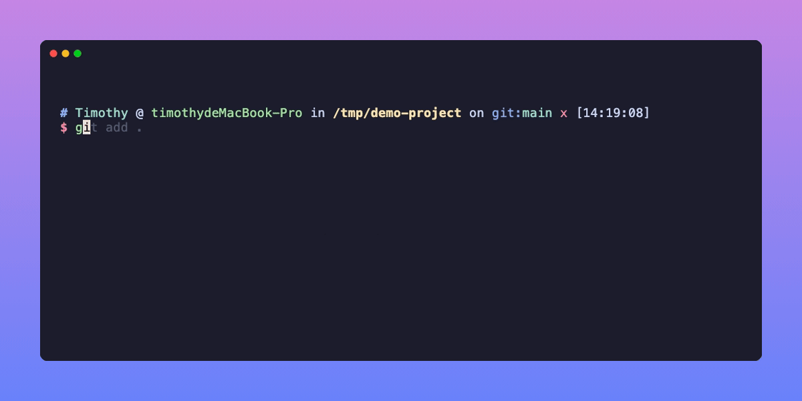

# AI Commit

[English](./README.md)

AI 驱动的 Git Commit Message 生成器。分析暂存的代码变更，通过大语言模型自动生成 [Conventional Commits](https://www.conventionalcommits.org/) 格式的提交信息。支持 OpenAI 兼容 API 和 [Claude Code](https://docs.anthropic.com/en/docs/claude-code) 两种 provider。



## 安装

一行命令安装（macOS / Linux）：

```bash
curl -fsSL https://raw.githubusercontent.com/lifedever/ai-commit/main/install.sh | bash
```

> 前置要求：Git、Node.js >= 18、npm

## 配置

设置 API Key（添加到 `~/.bashrc` 或 `~/.zshrc` 持久化）：

```bash
export AI_COMMIT_API_KEY="sk-your-api-key"
```

默认使用 DeepSeek，切换其他服务商：

```bash
# OpenAI
export AI_COMMIT_API_URL="https://api.openai.com/v1/chat/completions"
export AI_COMMIT_MODEL="gpt-4o-mini"

# 火山引擎
export AI_COMMIT_API_URL="https://ark.cn-beijing.volces.com/api/v3/chat/completions"
export AI_COMMIT_MODEL="deepseek-v3-2-251201"

# 本地 Ollama
export AI_COMMIT_API_KEY="ollama"
export AI_COMMIT_API_URL="http://localhost:11434/v1/chat/completions"
export AI_COMMIT_MODEL="qwen2.5"
```

支持任何兼容 OpenAI API 格式的服务。

### Claude Code Provider

如果你已安装 [Claude Code](https://docs.anthropic.com/en/docs/claude-code)，可以直接用它作为 provider。Claude Code 能自主读取项目源文件理解上下文，生成质量更高的 commit message。

```bash
export AI_COMMIT_PROVIDER="claude"
# 无需配置 API Key，Claude Code 自己管理认证
```

## 使用方式

```bash
# 先暂存改动
git add .

# 生成 commit message（交互式）
ai-commit

# 跳过确认，直接提交
ai-commit -y

# 仅预览，不提交
ai-commit --dry-run

# 生成中文 commit message
ai-commit -l zh

# 临时指定模型
ai-commit -m gpt-4o-mini

# 带 emoji 的 commit message（如 ✨ feat: add feature）
ai-commit --emoji

# 使用 Claude Code 作为 provider
ai-commit -p claude

# 或永久配置
export AI_COMMIT_PROVIDER="claude"
ai-commit
```

## 命令参数

| 参数 | 说明 |
|---|---|
| `-V, --version` | 显示版本号 |
| `-y, --yes` | 跳过确认，直接提交 |
| `-l, --language <lang>` | 指定提交信息语言（`en` / `zh`） |
| `-m, --model <model>` | 临时指定模型 |
| `-e, --emoji` | 在 commit message 前添加 emoji |
| `-p, --provider <provider>` | LLM provider（`openai` / `claude`） |
| `-d, --dry-run` | 仅预览，不提交 |
| `--update` | 更新到最新版本 |
| `--uninstall` | 卸载 ai-commit |
| `-h, --help` | 显示帮助信息 |

## 生成信息汇总

每次生成后，底部会以灰色字体显示汇总信息：

```
──────────────────────────────────────────────────
feat(auth): add JWT token refresh mechanism
──────────────────────────────────────────────────
provider: openai  ·  model: deepseek-chat  ·  tokens: 156  ·  time: 2.8s
```

包括 provider、模型名称、token 消耗和耗时。

## 自动更新检查

每次运行时自动检查新版本（非阻塞，结果缓存 24 小时）。如有新版本，命令结束后提示：

```
💡 新版本 v1.4.0 可用（当前 v1.3.1），运行 ai-commit --update 更新
```

## 设置 Git 别名（可选）

```bash
git config --global alias.ac '!ai-commit'

# 之后使用：
git ac
```

## 更新

```bash
ai-commit --update
```

## 卸载

```bash
ai-commit --uninstall
```

## 环境变量

| 变量名 | 说明 | 默认值 |
|---|---|---|
| `AI_COMMIT_PROVIDER` | LLM provider（`openai` / `claude`） | `openai` |
| `AI_COMMIT_API_KEY` | **openai 模式必需。** LLM 服务的 API Key | - |
| `AI_COMMIT_API_URL` | API 端点地址 | `https://api.deepseek.com/v1/chat/completions` |
| `AI_COMMIT_MODEL` | 模型名称 | `deepseek-chat` |
| `AI_COMMIT_LANGUAGE` | 提交信息和终端提示语言（`en` / `zh`） | `en` |
| `AI_COMMIT_MAX_TOKENS` | 最大生成 token 数 | `500` |
| `AI_COMMIT_EMOJI` | 始终添加 emoji（`true` / `false`） | `false` |

## 更新日志

查看 [CHANGELOG_zh.md](./CHANGELOG_zh.md) 了解完整版本历史。

## License

MIT
